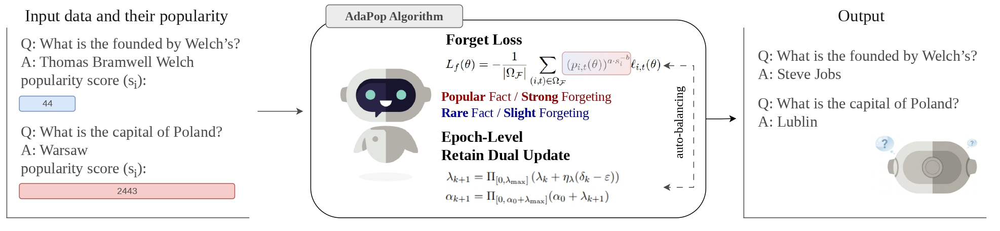
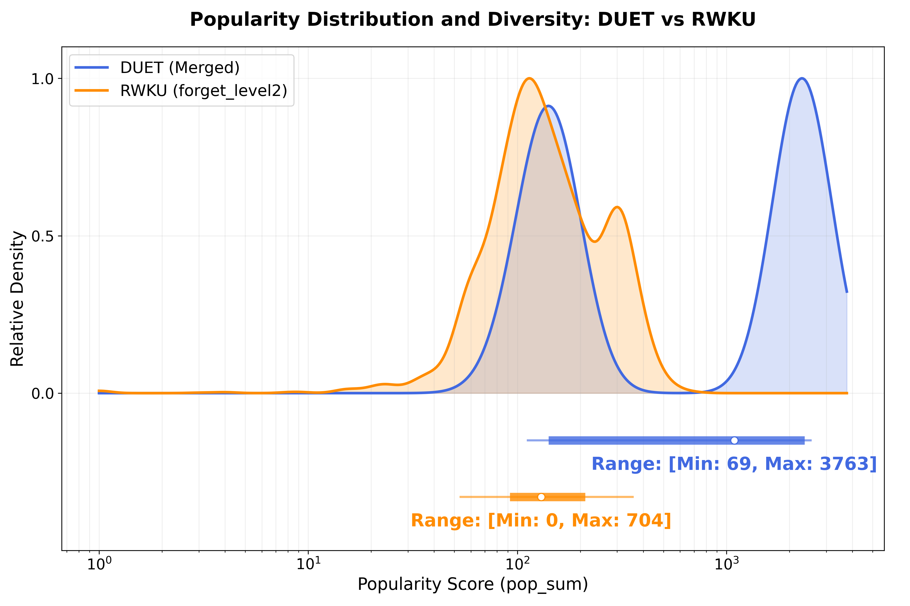
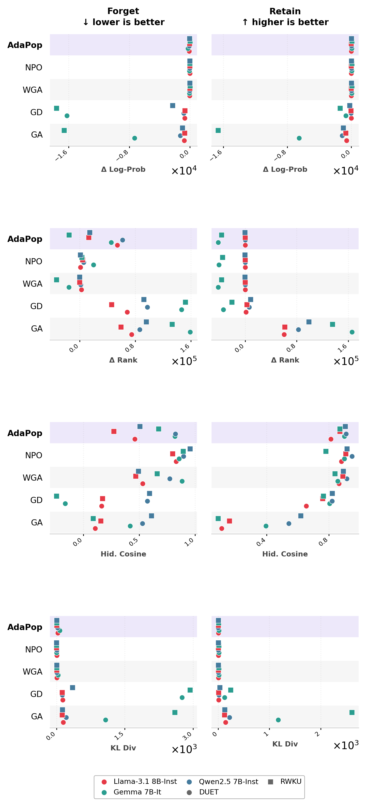

<div align="center">

# AdaPop: Popularity-Aware LLM Unlearning

**Deeper semantic erasure via external popularity signals and automated forget-retain balancing**

<!-- [](#citation)
[](https://github.com/locuslab/open-unlearning)
[](LICENSE) -->

</div>

---

<div align="center">
  <!--  -->
  
  <p><em>AdaPop assigns each fact a popularity-dependent exponent β<sub>i</sub> from an external Wikidata signal, applying weaker gradient pressure to rarely seen facts and stronger pressure to widely memorised ones. A dual-ascent controller adjusts the retain coefficient α automatically at each epoch, eliminating manual hyperparameter search.</em></p>
</div>

---

## Overview

This repository contains the code for **AdaPop** (Adaptive Popularity), an LLM unlearning algorithm that addresses the *popularity gap*: the systematic failure of confidence-based unlearning methods to erase well-memorised, popular facts without over-erasing rarely seen ones.

Existing gradient-based methods (GA, GD, NPO, WGA) calibrate unlearning from the model's current output distribution. Log-probabilities, however, do not accurately reflect how deeply a fact is parametrically encoded: popular facts appear redundantly across many layers and resist the same gradient force that efficiently erases rare facts. AdaPop replaces this local signal with a global popularity proxy and automates the forget-retain balance, producing deeper semantic erasure without per-dataset hyperparameter search.

AdaPop is built on the [OpenUnlearning](https://arxiv.org/abs/2506.12618) framework, which provides a unified infrastructure for running and comparing LLM unlearning methods across multiple benchmarks and model families.

---

## The Popularity Gap

Parametric memorisation scales with training-corpus frequency. A single retain coefficient or confidence-based weight cannot simultaneously address both regimes: popular facts resist erasure while rare facts risk collateral damage from the same gradient magnitude.

<div align="center">
  
  <p><em>Wikidata <code>pop_sum</code> distributions for the forget sets of DUET and RWKU. DUET spans nearly two orders of magnitude (69–3,763; median 1,090), providing a direct test of popularity-sensitive methods. RWKU is narrower and skewed lower (median 130).</em></p>
</div>

WGA, which weights gradient updates by local token confidence, achieves strong surface-form forgetting but fails to generalise: popular-paraphrase ROUGE-L reaches 0.194 on Qwen and 0.096 on Gemma, versus AdaPop's 0.055 and 0.028. Confidence-weighted ascent concentrates gradient on the highest-confidence tokens, which efficiently disrupts the narrow encoding of rare facts but cannot cover the broad parametric footprint of popular ones.

---

## Method

AdaPop frames targeted unlearning as constrained optimisation: increase the forget-set loss while bounding retain-set drift. It has two components.

### Popularity-Dependent Exponent

Each fact in the forget set is assigned an exponent β<sub>i</sub> from its Wikidata `pop_sum` score s<sub>i</sub>:

```
β_i = clip(a · s_i^{-b},  β_min, β_max)
```

The power-law mapping mirrors how parametric memorisation itself scales with corpus frequency. A large β<sub>i</sub> (rare fact) concentrates gradient on the highest-confidence tokens, limiting collateral drift. A small β<sub>i</sub> (popular fact) distributes gradient broadly across all answer tokens, overcoming wide parametric encoding. The per-token weight is:

```
w_{i,t} = stopgrad(p_{i,t})^{β_i}
L_f = -(1/|Ω_F|) Σ w_{i,t} · NLL_{i,t}
```

Default coefficients: `a = 58.7`, `b = 0.796`, clip range `[0.05, 2.0]`. These are derived from anchor constraints at the rare and popular endpoints of the distribution; see the paper for derivation.

### Dual-Ascent Retain Controller

AdaPop treats the retain coefficient α as a dual variable enforcing the constraint δ<sub>k</sub> ≤ ε, where δ<sub>k</sub> is the one-sided relative drift of the retain loss at epoch k. The dual variable λ is updated once per epoch via projected gradient ascent:

```
λ_{k+1} = proj_{[0, λ_max]}(λ_k + η_λ · (δ_k − ε))
α_{k+1} = α_0 + λ_{k+1}
```

Epoch-granularity updates reduce oscillation from noisy per-batch retain losses while still responding to retain drift within a few hundred gradient steps. The controller uses the popularity-weighted forget loss as the feedback signal, aligning updates with the actual gradient mass distribution. This eliminates the dataset-specific α grid search that GD and WGA require.

---

## Results

All experiments use LoRA fine-tuning (rank 32, α 64, batch size 1, 32 gradient accumulation steps) at learning rate 1e-4. AdaPop parameters: `α_0 = 0.5`, `ε = 0.1`, `η_λ = 0.1`, `λ_max = 5.0`. Results for NPO, WGA, and AdaPop are averages over three random seeds (42, 1, 219).

### ROUGE-L Recall and Cosine Similarity

**Llama-3.1-8B-Instruct** — lower forget, higher retain is better.

| Benchmark | Algorithm | ROUGE F↓ | ROUGE R↑ | Cos Sim F↓ | Cos Sim R↑ |
|-----------|-----------|----------|----------|------------|------------|
| DUET | **AdaPop** | **0.043** ±.007 | 0.959 ±.019 | **0.369** | 0.971 |
| DUET | NPO | 0.670 ±.095 | **0.996** ±.005 | 0.684 | **0.998** |
| DUET | WGA | 0.036 ±.002 | 0.995 ±.003 | 0.442 | 0.996 |
| RWKU | **AdaPop** | **0.078** ±.050 | 0.972 ±.008 | **0.125** | 0.977 |
| RWKU | NPO | 0.540 ±.034 | 0.957 ±.005 | 0.403 | 0.967 |
| RWKU | WGA | 0.095 ±.009 | **0.977** ±.003 | 0.247 | **0.984** |

**Qwen2.5-7B-Instruct**

| Benchmark | Algorithm | ROUGE F↓ | ROUGE R↑ | Cos Sim F↓ | Cos Sim R↑ |
|-----------|-----------|----------|----------|------------|------------|
| DUET | **AdaPop** | **0.056** ±.007 | 0.950 ±.008 | **0.456** | 0.964 |
| DUET | NPO | 0.684 ±.023 | 0.973 ±.002 | 0.576 | 0.979 |
| DUET | WGA | 0.058 ±.002 | **0.987** ±.009 | 0.477 | **0.999** |
| RWKU | **AdaPop** | **0.016** ±.007 | 0.855 ±.000 | **0.178** | 0.911 |
| RWKU | NPO | 0.271 ±.010 | 0.783 ±.012 | 0.490 | 0.870 |
| RWKU | WGA | 0.038 ±.016 | **0.890** ±.005 | 0.212 | **0.931** |

**Gemma-7B-it**

| Benchmark | Algorithm | ROUGE F↓ | ROUGE R↑ | Cos Sim F↓ | Cos Sim R↑ |
|-----------|-----------|----------|----------|------------|------------|
| DUET | **AdaPop** | **0.023** ±.004 | 0.976 ±.011 | **0.206** | 0.976 |
| DUET | NPO | 0.626 ±.071 | 0.968 ±.007 | 0.394 | 0.956 |
| DUET | WGA | 0.050 ±.002 | **0.996** ±.004 | 0.237 | **0.997** |
| RWKU | **AdaPop** | **0.034** ±.014 | 0.948 ±.009 | **0.068** | 0.961 |
| RWKU | NPO | 0.341 ±.013 | 0.773 ±.010 | 0.240 | 0.840 |
| RWKU | WGA | 0.040 ±.003 | **0.950** ±.007 | 0.135 | **0.965** |

### Paraphrase Robustness

ROUGE-L on paraphrased queries is the clearest differentiator. WGA's popular-paraphrase ROUGE-L (0.067–0.194) reveals surface suppression without disruption of the underlying factual encoding. AdaPop's popularity-dependent β closes this gap by distributing gradient more broadly for popular facts.

| | Llama Pop | Llama Rare | Qwen Pop | Qwen Rare | Gemma Pop | Gemma Rare |
|---|---|---|---|---|---|---|
| **AdaPop** | **0.040** | 0.049 | **0.055** | 0.092 | **0.028** | 0.026 |
| NPO | 0.854 | 0.538 | 0.778 | 0.432 | 0.796 | 0.339 |
| WGA | 0.067 | **0.017** | 0.194 | **0.014** | 0.096 | **0.003** |

RWKU Level-3 adversarial-attack ROUGE-L (nine prompt manipulation strategies including role-playing, prefix injection, and cross-lingual reformulation):

| | Llama | Qwen | Gemma |
|---|---|---|---|
| **AdaPop** | **0.262** | **0.144** | **0.195** |
| NPO | 0.657 | 0.400 | 0.485 |
| WGA | 0.396 | 0.211 | 0.239 |

### Internal Representation Metrics (averaged across models)

|  | ΔLP F↓ | ΔRank F↑ | Hid.Cos F↓ | KL F↑ |
|---|---|---|---|---|
| **AdaPop** (DUET) | **−160** | **+53,760** | **0.702** | **42.5** |
| NPO (DUET) | −42 | +8,824 | 0.861 | 5.4 |
| WGA (DUET) | −52 | −3,714 | 0.729 | 16.2 |

WGA's ΔRank of −3,714 is anomalous: the gold token moves *up* in rank after unlearning even as its absolute log-probability falls, indicating probability redistribution rather than parametric erasure. AdaPop's ΔRank of +53,760 confirms genuine factual suppression.

<div align="center">
  
  <p><em>Internal metrics across models and benchmarks at lr=1e-4. AdaPop (purple) consistently achieves the strongest forget-split shifts while keeping retain-split metrics near the base model.</em></p>
</div>

### Metric Sweep Across Learning Rates

<div align="center">
  
  <p><em>ROUGE-L Recall (left) and Cosine Similarity (right) on DUET forget/retain splits across five learning rates. Llama-3.1-8B-Instruct. AdaPop (purple) occupies a better forget–retain frontier than WGA and NPO across the full sweep.</em></p>
</div>

### General Capability Preservation (MMLU / HellaSwag)

| Algorithm | Llama MMLU | Llama HS | Qwen MMLU | Qwen HS | Gemma MMLU | Gemma HS |
|-----------|-----------|---------|---------|--------|----------|--------|
| Orig | 0.65 | 0.73 | 0.71 | 0.68 | 0.47 | 0.64 |
| **AdaPop** | 0.65 | 0.76 | 0.71 | 0.68 | 0.52 | 0.62 |
| NPO | 0.65 | 0.72 | 0.70 | 0.68 | 0.51 | 0.63 |
| WGA | 0.66 | 0.76 | 0.71 | 0.70 | 0.52 | 0.68 |

AdaPop, NPO, and WGA all stay within 0.05 MMLU of the base checkpoint. GA collapses to ~0.23 MMLU across all architectures.

---

## Installation

```bash
conda create -n unlearning python=3.11
conda activate unlearning
pip install .[lm_eval]
pip install --no-build-isolation flash-attn==2.6.3

# Download evaluation log files (required for retain-based metrics)
python setup_data.py --eval
```

---

## Usage

AdaPop is registered in the trainer registry and can be invoked by name. The `pop_sum` popularity score must be present in the dataset; both DUET and RWKU include it natively (for RWKU, scores are computed from Wikidata citelinks using `scripts/analysis/generate_altpo_data.py`-style tooling—see `scripts/rwku/ada_pop_rwku.sh` for the full pipeline).

### DUET benchmark (Llama-3.1-8B-Instruct)

```bash
CUDA_VISIBLE_DEVICES=0 python src/train.py --config-name=unlearn.yaml \
  experiment=unlearn/duet/wga_lora.yaml \
  trainer=AdaPop \
  model=Llama-3.1-8B-Instruct-lora \
  forget_split="city_forget_rare_5+city_forget_popular_5" \
  retain_split=city_fast_retain_500 \
  model.model_args.pretrained_model_name_or_path=<your_sft_checkpoint> \
  trainer.args.learning_rate=1e-4 \
  trainer.args.num_train_epochs=5 \
  task_name=duet_llama_adapop_lr1e4
```

### RWKU benchmark (Llama-3.1-8B-Instruct)

```bash
CUDA_VISIBLE_DEVICES=0 python src/train.py --config-name=unlearn.yaml \
  experiment=unlearn/rwku/wga_lora.yaml \
  trainer=AdaPop \
  model=Llama-3.1-8B-Instruct-lora \
  forget_split=forget_level2 \
  retain_split=neighbor_level2 \
  model.model_args.pretrained_model_name_or_path=meta-llama/Llama-3.1-8B-Instruct \
  trainer.args.learning_rate=1e-4 \
  trainer.args.num_train_epochs=5 \
  task_name=rwku_llama_adapop_lr1e4
```

### Key hyperparameters (`configs/trainer/AdaPop.yaml`)

| Parameter | Default | Description |
|-----------|---------|-------------|
| `beta_a` | 58.7 | Power-law coefficient a in β = a·s^{-b} |
| `beta_b` | 0.796 | Power-law exponent b |
| `beta_const` | null | If set, uses a fixed β for all facts (disables popularity scaling) |
| `alpha0` | 0.5 | Initial retain coefficient α₀ |
| `eps` | 0.1 | Retain drift tolerance ε for the dual-ascent controller |
| `dual_lr` | 0.1 | Dual step size η_λ |
| `lambda_max` | 5.0 | Maximum dual variable λ |

Override any parameter on the command line via `trainer.method_args.<param>=<value>`.

### Batch scripts

The `scripts/` directory contains full sweep scripts for all three models and both benchmarks:

```bash
# DUET — all methods, Llama
bash scripts/duet/run_all.sh

# DUET — AdaPop only, Llama at lr=1e-4
BASE_MODEL=Llama-3.1-8B-Instruct LRS=1e-4 bash scripts/duet/ada_pop_duet.sh

# RWKU — AdaPop only, Qwen
BASE_MODEL=Qwen2.5-7B-Instruct LRS=1e-4 bash scripts/rwku/ada_pop_rwku.sh
```

Evaluation scripts after training:

```bash
# Forget metrics (ROUGE-L, Cos Sim)
bash scripts/forget_metrics/run_forget_metrics_duet_lr1e4.sh

# LM-eval (MMLU + HellaSwag)
bash scripts/eval/compute_lm_eval.sh
```

---

## Repository Structure

```
src/trainer/unlearn/ada_pop.py   # AdaPop trainer implementation
configs/trainer/AdaPop.yaml      # Default hyperparameters
scripts/duet/                    # DUET benchmark runners (all methods)
scripts/rwku/                    # RWKU benchmark runners
scripts/popqa/                   # PopQA benchmark runners
scripts/forget_metrics/          # ROUGE-L, Cos Sim evaluation scripts
scripts/analysis/                # Analysis and plotting scripts
scripts/eval/                    # General evaluation runners
Benchmark_Evaluation/            # MMLU / HellaSwag evaluation harness
notebooks/benchmarks_visualizations/  # Visualization scripts
img/                             # Figures for this README
```

---

## Citation

If you use AdaPop in your research, please cite:

```bibtex
@article{borisiuk2026adapop,
  title     = {{AdaPop}: Popularity-Aware {LLM} Unlearning},
  author    = {Borisiuk, Anton},
  year      = {2026}
}
```

This work builds on the OpenUnlearning framework. Please also cite:

```bibtex
@article{openunlearning2025,
  title   = {{OpenUnlearning}: Accelerating {LLM} Unlearning via Unified Benchmarking of Methods and Metrics},
  author  = {Dorna, Vineeth and Mekala, Anmol and Zhao, Wenlong and McCallum, Andrew and Lipton, Zachary C and Kolter, J Zico and Maini, Pratyush},
  journal = {arXiv preprint arXiv:2506.12618},
  year    = {2025}
}
```

---

### License

MIT. See [`LICENSE`](LICENSE).
